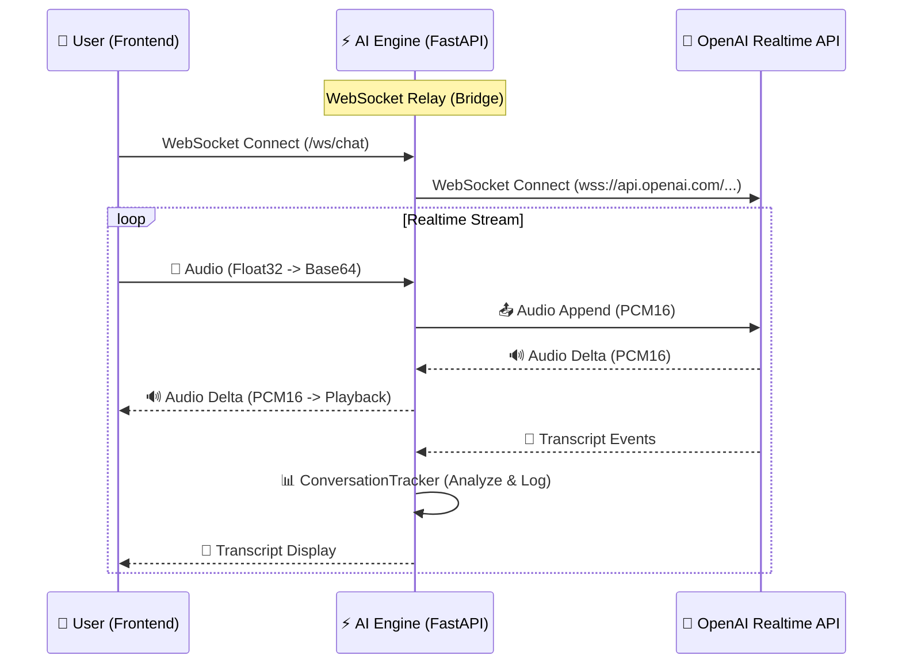

# Realtime Conversation Module

## 📌 개요 (Overview)
이 모듈은 **MaLangEE AI Engine**의 핵심 컴포넌트로, **OpenAI Realtime API(GPT-4o)**와 클라이언트(Frontend) 간의 **실시간 양방향 음성 대화**를 중계하고 관리합니다.

MSA(Microservices Architecture) 지향적인 설계를 따르며, 대화의 **상태 관리(State)**, **분석(Analytics)**, **제어(Control)**를 담당하여 백엔드 로직과 분리된 독립적인 AI 전담 처리반 역할을 수행합니다.

## 🏗️ 아키텍처 (Architecture)

## 🧩 주요 컴포넌트 (Components)

### 1. `ConnectionHandler` (`connection_handler.py`)
- **역할**: 클라이언트와 OpenAI 사이의 **중계자(Relay)**.
- **기능**:
    - 두 개의 WebSocket(Client↔Server, Server↔OpenAI)을 관리.
    - 오디오 스트림 및 이벤트를 실시간으로 토스(Pass-through).
    - 에러 핸들링 및 세션 초기화/종료 처리.

### 2. `ConversationManager` (`conversation_manager.py`)
- **역할**: 대화의 **설정(Config) 및 두뇌(Memory)** 관리.
- **기능**:
    - **System Prompt 관리**: AI의 페르소나(영어 튜터 등) 정의.
    - **동적 가이드**: 사용자의 상태(속도 등)에 따라 프롬프트를 실시간으로 변경(`session.update`).
    - API 세션 설정(VAD Threshold, Voice 등) 관리.

### 3. `ConversationTracker` (`conversation_tracker.py`)
- **역할**: 대화의 **분석가(Analyst)**.
- **기능**:
    - **메트릭 측정**: 대화 총 시간, 사용자 발화 시간(VAD 기반), 턴 수 측정.
    - **WPM 분석**: 사용자의 말하기 속도를 계산하여 **Slow / Normal / Fast** 상태 판별.
    - **리포트 생성**: 세션 종료 시 구조화된 JSON 데이터(`Session` + `Messages`) 반환.

### 4. `Frontend(테스트용)` (`static/index.html` + `processor.js`)
- **역할**: 오디오 입출력 인터페이스.
- **기능**:
    - **AudioWorklet**: 브라우저 마이크 입력을 실시간으로 가로채 PCM16으로 변환.
    - **Streaming Playback**: 수신된 오디오 조각을 끊김 없이 재생.

## 🔄 데이터 흐름 및 확장성 (Scalability)
- **비동기 처리**: `asyncio` 기반으로 설계되어 단일 프로세스에서도 다수의 동시 접속 처리가 가능합니다.
- **인터페이스 기반 저장**: 추후 `ISessionRepository` 인터페이스를 통해 로컬 DB(SQLite)뿐만 아니라 외부 API 또는 메인 백엔드 DB로 데이터를 유연하게 전송할 수 있습니다.
