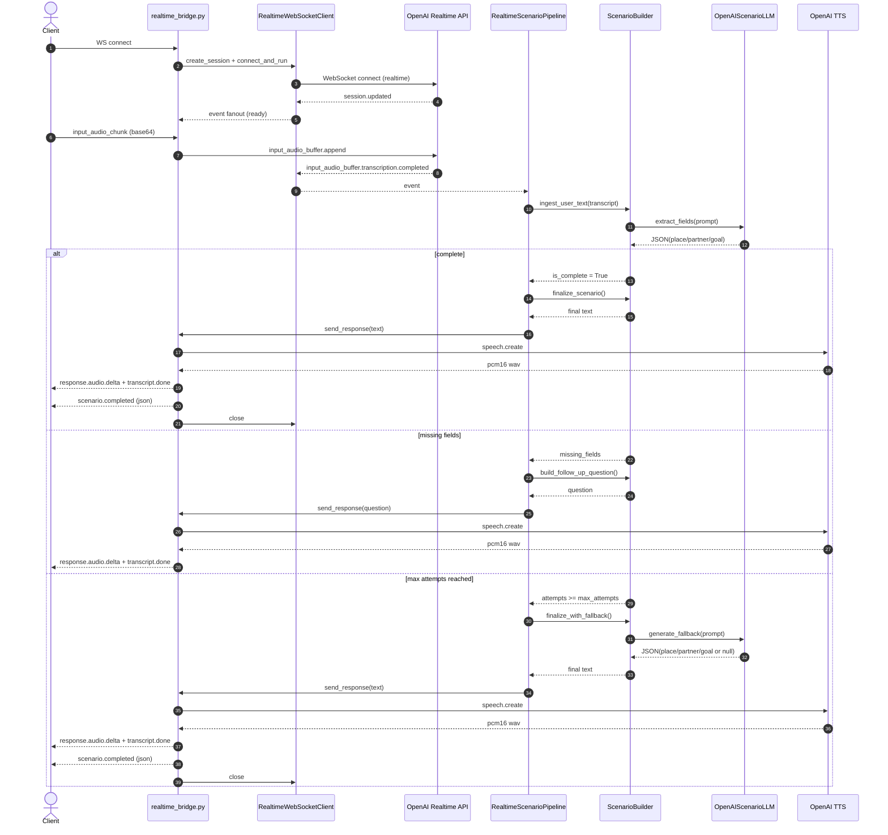

# 시나리오 모듈

이 디렉토리는 영어 회화 연습을 위한 실시간 시나리오 빌딩 흐름을 구현합니다.
클라이언트의 오디오/텍스트 입력을 OpenAI Realtime로 중계하고, 시나리오 필드를
추출한 뒤 후속 질문을 던지거나 최종 시나리오 응답을 생성합니다(TTS 오디오
스트리밍 포함 가능).

## 전체 흐름

- 클라이언트가 로컬 WS 릴레이(`realtime_bridge.py`)에 연결합니다.
- 오디오 청크를 OpenAI Realtime로 전송하고, 전사 결과가 이벤트로 돌아옵니다.
- `RealtimeScenarioPipeline`이 사용자 텍스트를 추출해 `ScenarioBuilder` 상태를 갱신하고
  다음 중 하나를 결정합니다.
  - 누락 필드에 대한 후속 질문
  - 시나리오 최종화(필요 시 폴백 포함)
- 응답은 클라이언트로 스트리밍되며, PCM16 오디오를 포함할 수 있습니다.

## 주요 모듈

- `realtime_bridge.py`: 클라이언트 <-> OpenAI Realtime WS 중계, TTS 처리.
- `realtime_session.py`: Realtime 세션 생성 및 WebSocket 클라이언트 관리.
- `realtime_pipeline.py`: 이벤트 기반 시나리오 빌딩 흐름 오케스트레이션.
- `scenario_builder.py`: 상태 관리, 질문 생성, 최종 시나리오 작성.
- `scenario_state.py`: place/partner/goal, 시도 횟수, 질문 이력 저장.
- `llm_client.py`: 추출/후속/최종/폴백 텍스트 생성용 OpenAI 호출.
- `prompts.py`: 프롬프트 빌더와 한국어 폴백 메시지.
- `audio_relay.py`: 응답 오디오/전사 텍스트를 클라이언트로 전달.
- `realtime_adapters.py`: Realtime 응답 전송 헬퍼.
- `fallbacks.py`: 에러 시 한국어 폴백 메시지 전송.
- `logging_utils.py`: 로깅 유틸.
- `factory.py`: LLM이 연결된 `ScenarioBuilder` 생성.

## 시퀀스 다이어그램



## 폴백/종료 흐름

- 최대 질문 횟수(`max_attempts`) 초과 시:
  - `ScenarioBuilder.finalize_with_fallback()` 실행
  - 폴백 프롬프트로 JSON 추출 시도(최대 2회)
  - 추출 실패 시에도 `finalize_scenario()`로 종료 문장 생성
- Realtime 오류 발생 시:
  - `fallbacks.py`가 한국어 폴백 메시지(`KOREAN_FALLBACK_MESSAGE`) 전송

## 핵심 이벤트 흐름

- 클라이언트 → 릴레이:
  - `input_audio_chunk`: base64 PCM16 오디오 청크
  - `input_audio_commit`: 서버 VAD 미사용 시 버퍼 커밋
  - `input_audio_clear`: 입력 버퍼 정리
  - `text`: 텍스트 입력(대화형 시나리오 시작 가능)
- OpenAI Realtime → 릴레이:
  - `input_audio_buffer.transcription.completed`: 사용자 음성 전사 완료
  - `response.audio.delta` / `response.audio.done`: 모델 오디오 스트림
  - `response.audio_transcript.delta` / `response.audio_transcript.done`: 모델 발화 전사

## 이벤트 페이로드 예시

```json
{
  "type": "input_audio_chunk",
  "audio": "<base64 pcm16>",
  "sample_rate": 24000
}
```

```json
{
  "type": "text",
  "text": "I am at a hotel talking to the receptionist to check in."
}
```

```json
{
  "type": "input_audio_buffer.transcription.completed",
  "transcript": "I'm at a hotel talking to the receptionist to check in."
}
```

```json
{
  "type": "response.audio.delta",
  "delta": "<base64 pcm16 chunk>",
  "sample_rate": 24000
}
```

```json
{
  "type": "scenario.completed",
  "json": {
    "place": "hotel",
    "conversation_partner": "receptionist",
    "conversation_goal": "check in"
  },
  "completed": true
}
```

## 메시지 매핑

| 방향 | 소스 이벤트 | 릴레이 동작 | 대상 이벤트 |
| --- | --- | --- | --- |
| Client → Bridge | `input_audio_chunk` | 오디오 버퍼 append | `input_audio_buffer.append` |
| Client → Bridge | `input_audio_commit` | (VAD off) 버퍼 commit | `input_audio_buffer.commit` |
| Client → Bridge | `input_audio_clear` | 버퍼 clear | `input_audio_buffer.clear` |
| Client → Bridge | `text` | 유저 메시지 생성 | `conversation.item.create` |
| OpenAI → Bridge | `input_audio_buffer.transcription.completed` | 텍스트 전달 | `input_audio.transcript` |
| OpenAI → Bridge | `response.audio.delta` | 오디오 중계 | `response.audio.delta` |
| OpenAI → Bridge | `response.audio_transcript.done` | 텍스트 중계 | `response.audio_transcript.done` |

## 상태 관리 포인트

- `ScenarioState`는 아래 필드가 모두 채워지면 완료로 판단합니다.
  - `place`: 대화 장소
  - `partner`: 대화 상대(직원/스태프 등)
  - `goal`: 대화 목적(체크인, 주문, 문의 등)
- `asked_fields`로 이미 질문한 항목을 추적해 중복 질문을 줄입니다.
- `attempts`는 질문 횟수이며, `max_attempts`를 넘기면 폴백 종료 경로로 진입합니다.

## 설정 및 튜닝 포인트

- `config.py` (`AppConfig`)
  - `realtime_model`, `llm_model`, `max_attempts`, `max_retries`
- `realtime_bridge.py` 내 `session_config`
  - `turn_detection`: 서버 VAD 사용 여부
  - `input_audio_transcription`: Whisper 모델 설정
- `prompts.py`
  - 추출/후속/최종/폴백 프롬프트, 한국어 폴백 메시지

## 환경 변수

- `OPENAI_API_KEY` 필수
- 선택: `OPENAI_REALTIME_MODEL`, `OPENAI_LLM_MODEL`

## 엔트리 포인트

- 로컬 릴레이 서버: `ai-engine/scripts/ws_realtime_bridge.py`
